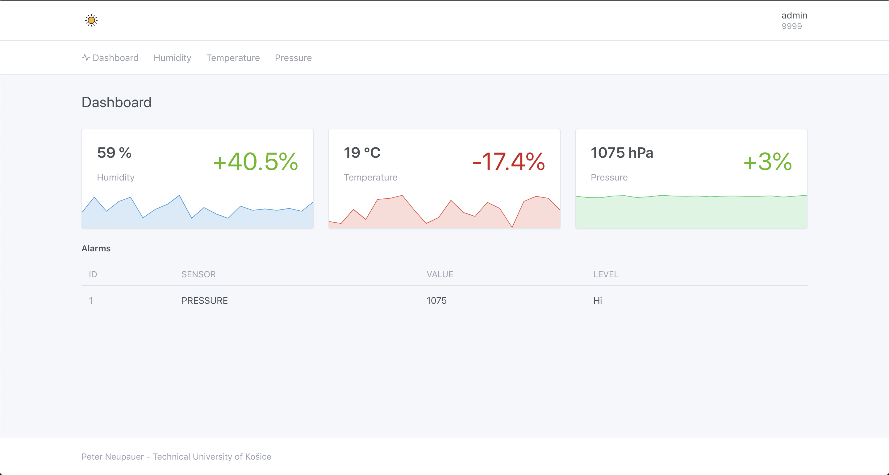
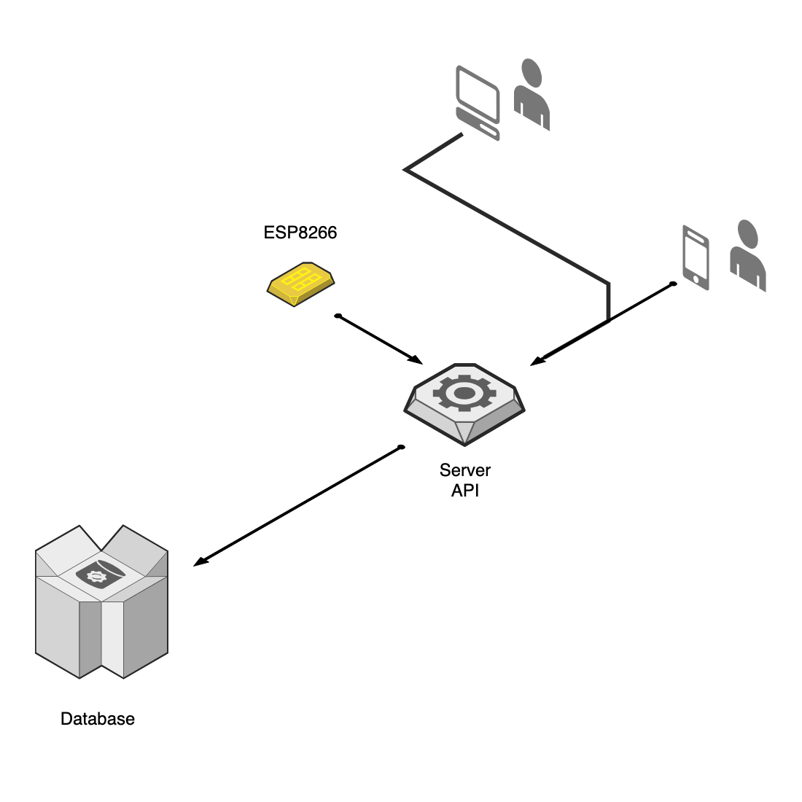

# Weather Station Visualization

Weather station visualization in real time. 

Semester project from subject RVS (Management and visualization systems) at Technical University of Košice.



## Getting started

### Web Server

To start the server, run the following command

```bash
node ./server.js
```

### Web Client

If the server is running, the client is available under the server root endpoint e.g. `localhost:8080`

Or you can host the client on your own, just copy `public/` to your webserver

If you are publishing client on the web do not forget customize value of `/src/index.jsx` > `window.APP_HOST` variable and then rebuild client

### ESP8266 Client

Upload `esp8266/main.ino` to your ESP8266 (or Arduino) and customize section `Customise these values` based on your settings

## Development

Run the following command before starting development

```bash
yarn install
```

To start development, run the following command

```bash
yarn dev
```

To build production ready bundle, run the following command

```bash
yarn production
```

### Architecture diagram



## License

MIT